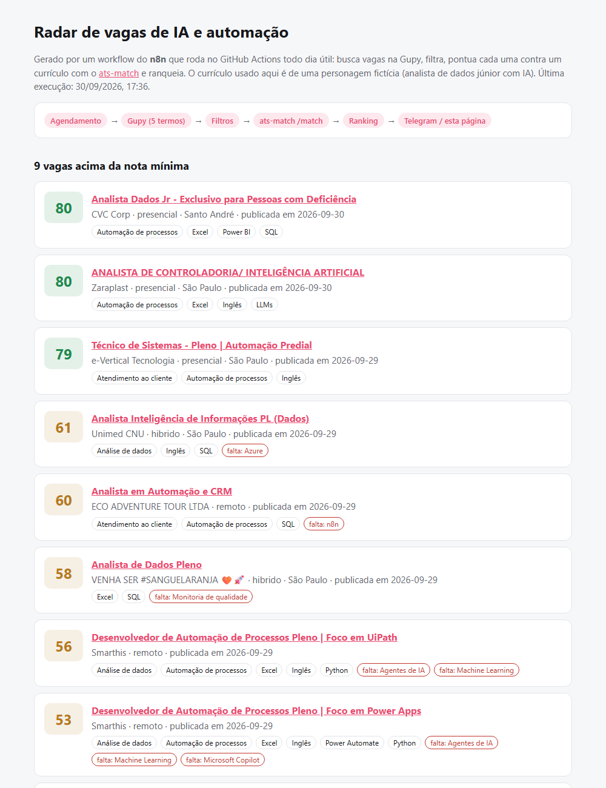
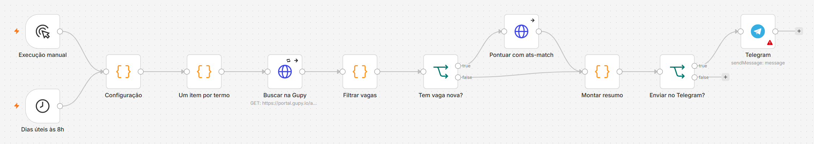

# radar-vagas-n8n

[](https://github.com/arthurpenedo/radar-vagas-n8n/actions/workflows/ci.yml)
[](https://github.com/arthurpenedo/radar-vagas-n8n/actions/workflows/radar.yml)


> Workflow do **n8n** que todo dia útil busca vagas na Gupy, filtra o que interessa, **pontua cada vaga contra o seu currículo** com uma API em Python ([ats-match](https://github.com/arthurpenedo/ats-match)) e manda o ranking no Telegram.

## O problema

Procurar vaga é repetitivo: abrir a Gupy, buscar os mesmos termos, pular as vagas sênior, as presenciais em outra cidade e as que já vi, e ler dezenas de descrições para descobrir quais batem com o meu perfil. É exatamente o tipo de tarefa que deve virar automação.

## Demo

**[arthurpenedo.github.io/radar-vagas-n8n](https://arthurpenedo.github.io/radar-vagas-n8n/)** — resultado da última execução. O GitHub Actions roda o workflow no n8n de verdade (pela linha de comando, sem interface) todo dia útil às 8h e publica o ranking. O currículo usado na demo é de uma personagem fictícia.

[](https://arthurpenedo.github.io/radar-vagas-n8n/)

## O workflow



```
Dias úteis às 8h ─┐
Execução manual ──┴─► Configuração ─► Um item por termo ─► Buscar na Gupy (HTTP, 3 tentativas)
                                                                     │
                     ┌──────────────────── Filtrar vagas ◄───────────┘
                     ▼                     (janela de horas, remoto/híbrido ou cidade, termos excluídos, duplicadas)
              Tem vaga nova? ──sim──► Pontuar com ats-match (POST /match) ──┐
                     └──não────────────────────────────────────────────────┴─► Montar resumo ─► Enviar no Telegram?
```

| Nó | O que faz |
|---|---|
| Configuração | Termos de busca, janela de horas, modelos aceitos, cidades, termos a excluir, nota mínima, currículo e Telegram. |
| Buscar na Gupy | Uma chamada por termo à API pública do portal da Gupy, com 3 tentativas; se uma busca falhar, as outras seguem. |
| Filtrar vagas | Remove repetidas entre termos, antigas, presenciais fora das cidades escolhidas e títulos com termos excluídos (sênior, gerente...). Conta cada descarte por motivo. |
| Pontuar com ats-match | Manda currículo + descrição para a API do ats-match e recebe a nota 0–100 e as habilidades obrigatórias que faltam. |
| Montar resumo | Ranqueia pela nota, aplica a nota mínima e gera a mensagem do Telegram (MarkdownV2, dentro do limite de 4096 caracteres). |

## Decisões técnicas

- **A lógica dos nós Code vive em arquivos `.js` testados.** `src/filtrar.js` e `src/resumo.js` rodam com `node --test` contra uma resposta real da Gupy salva em `tests/fixtures/`. O `scripts/build.js` injeta esse código no JSON do workflow, e o CI falha se o `workflows/radar-vagas.json` commitado não bater com as fontes. Editar JavaScript dentro de uma string de JSON não é revisável nem testável.
- **O workflow roda de verdade no CI.** O GitHub Actions instala o n8n, sobe a API do ats-match, importa o workflow e o executa com `n8n execute`. A página publicada é o resultado dessa execução, não um mock.
- **n8n orquestra, Python calcula.** A nota de aderência já existia como API no ats-match; o n8n só chama `POST /match`. Cada ferramenta faz o que faz melhor, e a regra de pontuação continua testada no projeto dela.
- **Falhar parcialmente em vez de parar.** Busca que falha não derruba as outras; vaga que o ats-match não consegue pontuar entra na contagem "sem nota" em vez de sumir.
- **Sem estado entre execuções.** "Vaga nova" é decidido pela data de publicação (janela de horas), não por uma lista de vagas já vistas. Funciona igual numa instância do n8n e num runner descartável do CI.
- **Nada de segredo no JSON.** O Telegram usa a credencial do próprio n8n; o workflow exportado não carrega token.

## Como usar

**No seu n8n** (self-hosted ou n8n Cloud):

1. Suba o ats-match em algum lugar acessível pelo n8n:
   ```bash
   pip install "ats-match @ git+https://github.com/arthurpenedo/ats-match"
   uvicorn ats_match.api:app --host 0.0.0.0 --port 8000
   ```
2. Importe `workflows/radar-vagas.json` (menu **Import from file**).
3. No nó **Configuração**, troque o currículo pelo seu, ajuste termos e filtros e aponte `ats_url` para a API.
4. Para receber no Telegram: crie um bot com o @BotFather, cadastre a credencial no nó **Telegram**, preencha `telegram.chat_id` e mude `telegram.ativo` para `true`.
5. Ative o workflow.

**Pela linha de comando** (como o CI faz):

```bash
npm install -g n8n@2.41.4
n8n import:workflow --input=workflows/radar-vagas.json
n8n execute --id=radarVagasN8n001 --rawOutput > execucao.json
node scripts/extrair.js execucao.json resumo.json
node scripts/pagina.js resumo.json site/index.html
```

**Desenvolvendo:**

```bash
npm test                 # testes da lógica (node --test)
npm run build            # regenera o workflow depois de mudar src/ ou config/
```

## Limitações

- Usa a API pública que o portal da Gupy usa no próprio site; ela não é documentada e pode mudar (o endpoint mudou durante o desenvolvimento deste projeto, e o CI diário é o que avisa).
- A nota do ats-match é por palavras-chave e habilidades, não por semântica.
- Só a Gupy por enquanto.

## Próximos passos

- [ ] Mais fontes (LinkedIn via RSS, Greenhouse, sites próprios)
- [ ] Registrar as vagas escolhidas no [vagas-mcp](https://github.com/arthurpenedo/vagas-mcp) / Notion
- [ ] Resumo com LLM das 3 melhores vagas (por que combinam, o que destacar no currículo)

---

Feito por [Arthur Penedo](https://github.com/arthurpenedo) · [LinkedIn](https://www.linkedin.com/in/arthuralves-penedo)
